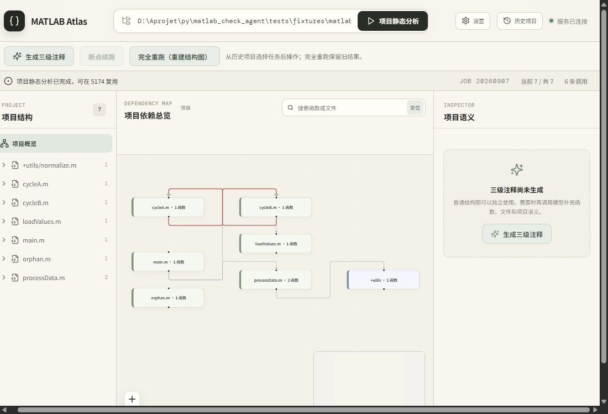
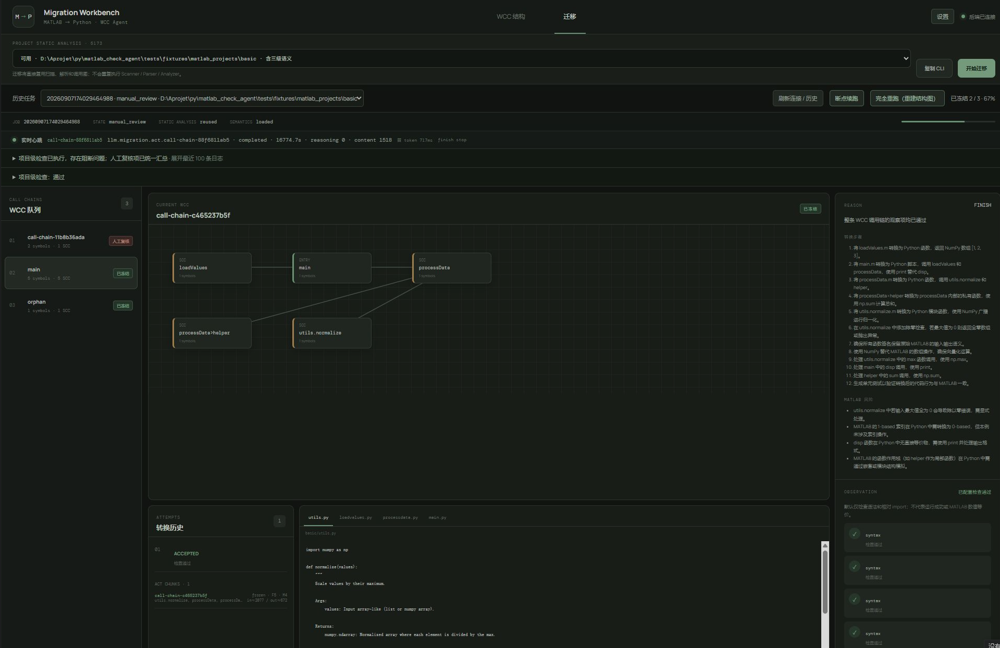

# MATLAB Atlas

MATLAB Atlas 是一个面向中大型 MATLAB 代码库的代码理解与迁移工具。它先用确定性分析还原文件、函数、调用关系和循环依赖，再按需生成函数—文件—项目三级语义，并以可恢复的 Agent Loop 辅助 MATLAB → Python 迁移。

项目分为两个可以独立使用的应用：

| 应用 | 解决的问题 | 当前能力 |
| --- | --- | --- |
| **Semantic App** | MATLAB 工程越大，入口、调用链、孤立代码和模块职责越难看清 | 项目静态分析、代码树、调用图、SCC 循环簇、源码浏览、三级语义生成与自检 |
| **Migration App** | 一次性让模型转换整个项目容易丢上下文、难验证、失败后只能重来 | 复用静态分析，按 WCC/SCC 分解迁移，Reason → Act → Observation，断点续跑和人工复核 |

普通静态分析不需要大模型。三级语义和 Python 迁移需要配置 OpenAI-compatible 模型。MATLAB 输入目录始终按只读数据处理，生成结果与任务状态保存在独立的 Artifact Store 中。

> 项目状态：Semantic App 已可用于结构分析和语义理解；Migration App 已实现静态转换闭环，但默认验证仍限于 Python 语法、相对 import 和可注入测试，不等同于 MATLAB/Python 数值等价或生产验收。

## 快速开始

### 方式一：Windows 免安装单文件版（最快体验）

Windows 10/11 x64 用户可以直接下载发布页中的：

```text
MATLAB-Atlas-v0.1.0-win-x64.exe
MATLAB-Atlas-v0.1.0-win-x64.exe.sha256
```

将 `.exe`、`.env` 和 `data/` 放在同一目录，校验 SHA256 后直接双击 `.exe`，无需安装和管理员权限。首次只复制 `.exe` 也可以：程序会在旁边自动创建 `.env`、`data/` 和 `logs/`。启动后请保持状态控制台开启；程序会自动打开前端，按 `Ctrl+C` 或关闭控制台即可停止。目标电脑不需要安装 Python、Node.js、pnpm 或 Docker：

- Semantic App：`http://127.0.0.1:8000`
- Migration App：`http://127.0.0.1:8001`

程序只监听本机地址，适合一台电脑由一个用户使用。模型配置、API Key、SQLite、日志和任务产物都保存在 `.exe` 同目录；更新时只替换 `.exe`，不要覆盖 `.env` 和 `data/`。完全断网时，普通静态分析仍可使用；三级语义和 Python 迁移需要配置可访问的内网模型 API。

如需自行构建，请在 Windows PowerShell 中安装 Node.js 22、pnpm 和 Python 3.10+，然后运行：

```powershell
powershell -ExecutionPolicy Bypass -File packaging/windows/build.ps1
```

单文件版、`.env` 模板、数据目录和校验文件均生成在 `build/windows/dist/`，复制该目录到另一台 Windows 电脑即可使用。

### 方式二：从 GitHub 安装源码

环境要求：Python 3.10+、Node.js 22（推荐）和 pnpm。

```bash
git clone https://github.com/qndydc/matlab_check_agent.git
cd matlab_check_agent
python -m pip install -e ".[dev]"
pnpm --dir apps/semantic/frontend install
pnpm --dir apps/migration/frontend install
```

复制配置模板。普通结构分析可以暂时不填写 API Key：

Linux / macOS：

```bash
cp .env.example .env
```

Windows PowerShell：

```powershell
Copy-Item .env.example .env
```

启动两个开发应用（分别在两个终端运行）：

```bash
python scripts/start_mvp.py
python scripts/start_migration.py
```

| 应用 | 前端 | 后端 |
| --- | --- | --- |
| Semantic App | `http://127.0.0.1:5173` | `http://127.0.0.1:8000` |
| Migration App | `http://127.0.0.1:5174` | `http://127.0.0.1:8001` |

也可以分开启动前后端：

```bash
# Semantic
matlab-semantic-web
pnpm --dir apps/semantic/frontend dev --host 127.0.0.1 --port 5173 --strictPort

# Migration
matlab-migration-web
pnpm --dir apps/migration/frontend dev --host 127.0.0.1 --port 5174 --strictPort
```

### 方式三：Docker Compose

Docker 版本把两个前端、两个 API 和统一任务池放在一个应用进程中，由 Nginx 对外提供 8000/8001。部署机不需要安装 Python、Node.js 或 pnpm。

```powershell
Copy-Item .env.docker.example .env
# 编辑 .env，至少设置数据目录和管理员工号
docker compose up -d --build
```

启动后访问：

- Semantic App：`http://127.0.0.1:8000`
- Migration App：`http://127.0.0.1:8001`

首次进入页面输入工号，上传 MATLAB 项目的 ZIP 后即可分析；服务器无需访问用户电脑或其他代码服务器。只有 `MATLAB_ADMIN_EMPLOYEE_IDS` 指定的工号能够修改全局模型设置。

当前 Compose 使用一个 `matlab-atlas:0.1.0` 应用镜像和一个 Nginx 镜像。正式发布到 GHCR 时应发布统一应用镜像；升级前请先备份数据目录。

Windows、联网 Linux、断网内网、备份、升级和回滚步骤见 [Docker 部署指南](docs/docker-deployment.md)。

## CLI 使用

所有命令共用 `matlab-refactor` 入口，也可以用 `python -m matlab_refactor_agent` 代替：

```bash
# 扫描文件和函数
matlab-refactor scan /path/to/matlab-project

# 构建调用图、SCC 和结构树
matlab-refactor analyze /path/to/matlab-project --tree

# 生成函数、文件、项目三级语义
matlab-refactor annotate /path/to/matlab-project

# 执行 MATLAB → Python WCC Agent Loop
matlab-refactor migrate /path/to/matlab-project

# 从已有迁移任务断点续跑
matlab-refactor migrate --resume <job-id>

# 查询核心任务状态
matlab-refactor status <job-id>
```

Windows 路径示例：`D:\MATLAB\signal_project`；Linux 路径示例：`/srv/matlab/signal_project`。完整参数、产物位置和恢复规则见 [使用教程](docs/使用教程.md)。

## 界面预览

### Semantic App：项目结构与调用图



### Migration App：WCC 迁移工作台



## 它是怎样工作的

```text
MATLAB Repository
        │
        ▼
确定性结构分析：scan → parse → symbols → call graph → SCC/WCC
        │
        ├── Semantic Pipeline：函数 → 文件 → 项目三级语义与质量自检
        │
        └── Migration Agent：Reason → Act → Assemble → Observation → Freeze/Repair
```

进一步阅读：

- [项目结构与代码导航](docs/structure.md)
- [结构图拆分算法](docs/structure-analysis.md)
- [三级语义生成算法](docs/semantic-pipeline.md)
- [MATLAB → Python Agent Loop](docs/matlab-to-python-agent-loop.md)
- [完整使用教程](docs/使用教程.md)

## 安全边界

- 扫描的 MATLAB 仓库只读，生成代码不会覆盖输入项目。
- LLM 负责语义解释和转换建议，不能修改解析器得到的结构事实。
- API Key 只写入本地 `.env`，前端不回显、不存入浏览器存储。
- 未解析调用、低置信度结果和验证失败不会被静默标记为成功。
- `completed` 或 `frozen` 只表示已配置的检查通过；投入生产前仍需运行测试和数值验收。

## 开发验证

```bash
python -m pytest
pnpm --dir apps/semantic/frontend build
pnpm --dir apps/migration/frontend build
git diff --check
```

贡献代码前请阅读 [项目结构](docs/structure.md) 和仓库中的 `AGENTS.md`。
