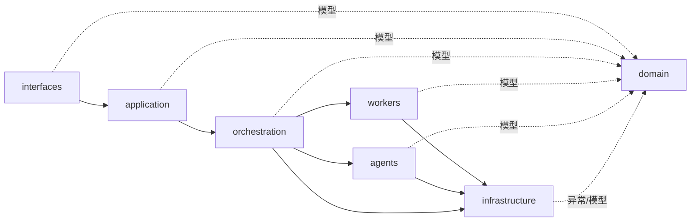
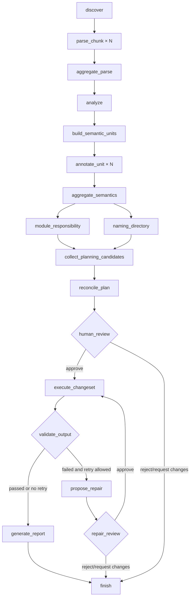

# 项目结构

本文面向维护者，描述当前仓库结构、模块调用方向，以及一个 MATLAB 项目从输入到隔离输出代码库的完整过程。内容以当前 `src/` 实现为准。

## 架构原则

1. `domain` 定义跨层 Pydantic 数据契约，不依赖具体基础设施。
2. `workers` 集中承载扫描、分块解析、依赖分析和图输出等确定性能力。
3. `agents` 只负责需要语义推理的结构化建议，不直接修改 MATLAB 文件。
4. `orchestration` 是唯一跨阶段控制流，负责并行、checkpoint、审批、执行和验证。
5. 大型结果写入 ArtifactStore；LangGraph State 只保存控制字段和 artifact 引用。
6. 输入项目只读，所有修改发生在隔离输出目录。

## 顶层目录

```text
matlab_check_agent/
├── README.md                   GitHub 用户安装与使用指南
├── structure.md                当前代码结构与数据流
├── 项目规划.md                  完成情况与后续路线
├── pyproject.toml              包、依赖、CLI 和测试配置
├── .env.example               完整环境变量模板
├── src/matlab_refactor_agent/ Python 源码
├── tests/                     单元、集成测试和 MATLAB fixture
└── var/                       运行产物；被 Git 忽略
```

## `src` 调用方向



上层可以调用下层；`domain` 是共享契约。确定性 Worker 和 LLM Agent 不互相直接调度，而是由 LangGraph 工作流协调。

## 源码文件说明

### 包入口

```text
src/matlab_refactor_agent/
├── __init__.py       包版本
└── __main__.py       python -m 入口，转发到 CLI main()
```

### `interfaces`：用户接口

| 文件 | 职责 |
| --- | --- |
| `interfaces/cli/main.py` | 定义 `scan/analyze/annotate/plan/review/report/status`；加载配置、调用应用服务、处理 JSON 和图文件输出。 |
| `interfaces/cli/render.py` | 使用 Rich 展示扫描、分析、语义、审批、状态和报告。 |
| `interfaces/__init__.py`、`interfaces/cli/__init__.py` | 包边界。 |

正式入口：

```text
pyproject console script 或 __main__.py
→ interfaces.cli.main::main
→ AnalysisService
```

### `application`：应用用例门面

| 文件 | 职责 |
| --- | --- |
| `application/services.py` | 将 CLI 用例映射到 Orchestrator：`scan`、`analyze`、`annotate`、`plan`、`review`、`report`。 |
| `application/__init__.py` | 导出 `AnalysisService`。 |

该层不实现算法，只隔离接口层和具体工作流。

### `workers`：确定性处理

| 文件 | 职责 |
| --- | --- |
| `workers/base.py` | `BaseWorker` 和只读 `WorkerContext`。 |
| `workers/scanning.py` | 递归发现 `.m` 文件、排除路径，并提供同步项目扫描。 |
| `workers/scanner_agent.py` | Worker-1：生成 `file-manifest.json`。 |
| `workers/parser_protocol.py` | MATLAB 单文件解析器协议。 |
| `workers/matlab_parser.py` | maxx/Tree-sitter 适配，提取 MATLAB 文件及函数元数据。 |
| `workers/parser_agent.py` | Worker-2：解析分块并聚合为 `scan-result.json`。 |
| `workers/dependency_analysis.py` | 使用 NetworkX 构建调用图，以 SCC 计算循环簇及少量代表性环，并分析入口、孤立和未解析调用。算法核心由语义注解阶段根据源码判断。 |
| `workers/analyzer_agent.py` | Worker-3：读取扫描 artifact，生成 `analysis-result.json`。 |
| `workers/graph_output.py` | 将分析结果投影为 Rich 依赖树、Graph JSON 和 Mermaid `.mmd`。 |
| `workers/__init__.py` | 延迟导出 Worker 及确定性能力，避免不必要的导入副作用。 |

确定性预处理调用链：

```text
ScannerAgent → scanning
ParserAgent  → matlab_parser
AnalyzerAgent → dependency_analysis
CLI analyze → graph_output
```

输出验证器也复用 `scanning`、`matlab_parser` 和 `dependency_analysis`，确保重构前后使用同一套事实工具。

### `agents`：语义推理

| 文件 | 职责 |
| --- | --- |
| `agents/base.py` | `BaseAgent` 与 `AgentContext`；Agent 只能通过 ArtifactStore 读取上下文。 |
| `agents/planning_context.py` | 从 analysis 和 semantic artifacts 构建规划上下文。 |
| `agents/module_responsibility.py` | 提出模块职责、边界和依赖。 |
| `agents/naming_directory.py` | 提出函数新名称和目标目录。 |
| `agents/repair.py` | 根据失败验证证据提出有限修复操作。 |
| `agents/natural_language_report.py` | 根据计划、ChangeSet 和验证事实生成 JSON/Markdown 报告。 |
| `agents/semantic_annotation/context_builder.py` | 按 SCC、依赖关系和 token 预算构建语义工作单元及源码上下文。 |
| `agents/semantic_annotation/agent.py` | 调用结构化 LLM 生成函数簇注解。 |
| `agents/semantic_annotation/aggregator.py` | 聚合为函数、文件、项目三级语义，并记录冲突。 |

Agent 输出必须通过 Pydantic 校验。模型不能修改工具产生的路径、哈希或验证状态。

### `orchestration`：跨阶段工作流

| 文件 | 职责 |
| --- | --- |
| `orchestration/workflow.py` | LangGraph StateGraph、动态 fan-out/fan-in、条件路由、interrupt、恢复和完整生命周期。 |
| `orchestration/orchestrator.py` | `LangGraphWorkflow` 的兼容外部类名。 |
| `orchestration/worker_pool.py` | 按 `WorkerKind` 注册和路由确定性 Worker。 |
| `orchestration/state_manager.py` | SQLite/WAL Job 与 Task 审计投影，供 `status` 使用。 |
| `orchestration/quality_gate.py` | 验证 Scanner、Parser、Analyzer 的输出和 artifact 不变量。 |
| `orchestration/conflict_resolver.py` | 检测并发任务的路径声明冲突。 |
| `orchestration/plan_reconciler.py` | 合并模块和命名候选，检查名称、路径、覆盖与移动冲突。 |
| `orchestration/changeset_executor.py` | 复制源树、改写符号、移动文件、记录哈希并原子发布隔离代码库。 |
| `orchestration/project_validator.py` | 重新扫描输出，验证源/输出完整性、解析、计划符合性和调用图。 |
| `orchestration/__init__.py` | 导出公共编排组件。 |

### `infrastructure`：外部适配

| 文件 | 职责 |
| --- | --- |
| `infrastructure/config.py` | 合并默认值、`.env` 和进程环境变量，并严格校验。 |
| `infrastructure/artifacts.py` | 在 Job 目录中安全、原子地读写 Pydantic JSON。 |
| `infrastructure/logging.py` | 初始化日志级别。 |
| `infrastructure/llm/client.py` | OpenAI-compatible 结构化请求、SDK 重试、响应重试和模型校验。 |
| `infrastructure/llm/factory.py` | 从配置和环境变量创建真实 LLM 客户端。 |

### `domain`：数据契约

| 文件 | 主要模型 |
| --- | --- |
| `domain/models.py` | 文件、函数、扫描和依赖分析结果。 |
| `domain/orchestration.py` | Job、Task、WorkerResult 和基础 Outcome。 |
| `domain/agents.py` | AgentRequest、AgentProposal、AgentResult。 |
| `domain/semantics.py` | 语义工作单元、源码证据、三级 SemanticIndex。 |
| `domain/planning.py` | 规划上下文、候选、冲突、RefactorPlan 和 ReviewDecision。 |
| `domain/changes.py` | 实际文件变更和 ChangeSet。 |
| `domain/validation.py` | ValidationCheck、ValidationResult、RepairProposal。 |
| `domain/reporting.py` | 报告草稿、最终报告和查询 Outcome。 |
| `domain/enums.py` | MATLAB 对象、Worker、Agent、Job 和 Task 枚举。 |
| `domain/exceptions.py` | 配置、解析、LLM、artifact、冲突和执行异常。 |

## LangGraph 主流程



`scan`、`analyze` 和 `annotate` 使用同一张图，但会在对应阶段提前进入 `finish`。`plan` 才会继续进入人工审批、执行和验证。

## 输入项目到输出代码库

### 1. 发现与解析

```text
输入目录
→ MatlabFileDiscovery
→ file-manifest.json
→ 按 parser_chunk_size 分块
→ parse-chunk-xxxxx.json
→ scan-result.json
```

manifest 固定本次 Job 的文件集合。聚合阶段会拒绝缺失、重复或 manifest 外文件。

### 2. 依赖与语义

```text
scan-result.json
→ DependencyAnalyzer
→ analysis-result.json
→ SCC/依赖聚类和受控源码上下文
→ LLM 语义注解
→ semantic-index.json
```

### 3. 规划与审批

```text
analysis + semantic index
→ ModuleResponsibilityAgent || NamingDirectoryAgent
→ planning candidates
→ PlanReconciler
→ refactor-plan.json
→ LangGraph interrupt 等待审批
```

Agent 提出候选，`PlanReconciler` 确定性检查 MATLAB 标识符、覆盖完整性、目标路径冲突和移动循环。

### 4. 隔离执行

`ChangeSetExecutor` 的顺序是：

1. 校验输入与输出不嵌套。
2. 计算输入目录树哈希。
3. 把输入项目复制到输出根目录下的临时 staging。
4. 在 staging 内改写 MATLAB 标识符和调用引用。
5. 通过分阶段移动完成文件重命名和目录调整。
6. 再次计算输入目录树哈希；变化则终止。
7. 计算输出树哈希，写入 `.matlab-refactor-changeset.json`。
8. 通过目录原子替换发布 `<output_dir>/<job_id>/`。

输入目录从不作为写入目标。

### 5. 验证、修复和报告

输出代码库会被重新扫描和分析。当前检查包括：

- `source_integrity`：输入目录树没有变化；
- `output_integrity`：输出与 ChangeSet 哈希一致；
- `matlab_parse`：输出 MATLAB 文件可完整解析；
- `plan_conformance`：目标路径和符号映射已实现；
- `dependency_graph`：关键调用图不变量保持一致；
- `matlab_runtime`：MATLAB Engine 可用性及未来运行时检查入口。

失败且未超过重试上限时，RepairAgent 生成新计划并再次等待审批。批准后生成 `<job_id>-repair-<N>/`，不会覆盖旧输出。最终报告严格以工具事实为准。

## 运行数据布局

```text
var/
├── jobs/<job-id>/                阶段 artifacts
├── refactor-agent.db             Job/Task 状态
├── langgraph-checkpoints.db      图 checkpoint 和 interrupt
├── graphs/                       Graph JSON 和 Mermaid
├── refactored-projects/          隔离输出代码库
└── reports/<job-id>/             JSON/Markdown 报告
```

`var/` 是运行状态，不属于源码结构，默认被 Git 忽略。

## 测试结构

```text
tests/
├── fixtures/                     MATLAB 示例项目与测试配置
├── unit/                         解析、图、Agent、配置和编排组件测试
└── integration/                  CLI、Orchestrator 和完整语义/审批闭环
```

运行全部测试：

```powershell
python -m pytest
```
